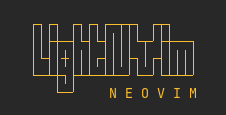
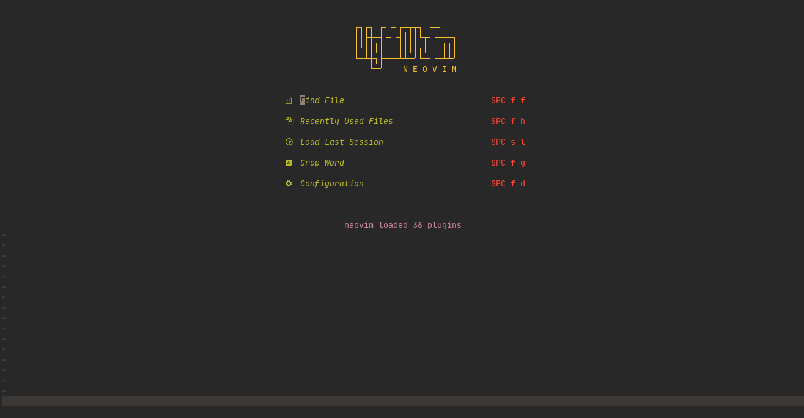
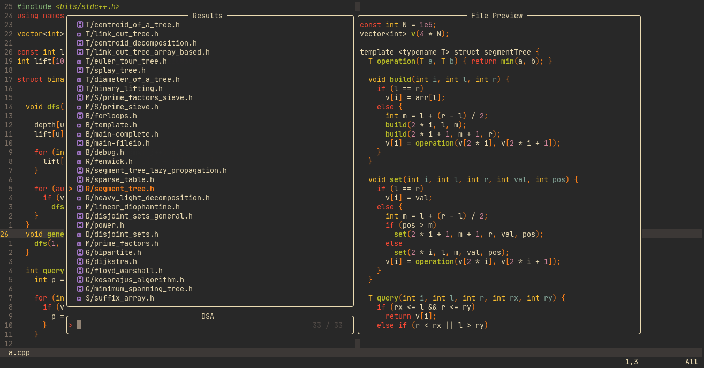
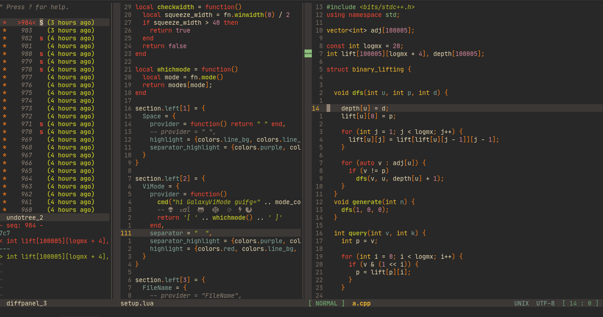

<!-- <center>
<h2>Neovim Configs</h2> -->

<!-- </center> -->

---






### Plugins

 Checkout [this](lua/settings/plugins.lua) file for all the plugins I am using. Listing all here is taking too much time.


### Branches

1. ```main``` - This branch will be the primary branch and will contain all the LSP servers I need + all the settings other branches will have. So this will be the goto branch for everything.
2. ```restructure``` - This branch is a restructure of the minified branch with directory structure little bit modified.
3. ```minified``` - This branch meets the minimum needs (but still have some fancy plugins, which I may remove to make it really minified).

I also have a ```.vimrc``` file minfied in my [dotfiles](https://github.com/Tinku10/dotfiles) repo.

### Font
 JetBrains Mono Nerd Font (non-ligature), downloaded from [Nerd Fonts](https://www.nerdfonts.com/)

### Terminal
[Kitty](https://sw.kovidgoyal.net/kitty/index.html)

### **NOTE**
I have disabled some installed plugins, which can be enabled by ```require```ing it in the appropriate file.

### Support
If you like this configuration or if this is helping you in any way, I would appreciate if you could leave a star ⭐ in this repo.

### Feedback
Feel free to leave a feedback or suggestion if you find some bug or if I could improve the directory layout or in general anything.

Also if you have a good name suggestion for this repo, please feel free to leave it here.

### Mentions

* I took help from the [NVCode](https://github.com/ChristianChiarulli/LunarVim/tree/nvcode) repo to set up the LSPs, so a huge thanks to [Christian](https://github.com/ChristianChiarulli).

* My initial ```.vimrc``` was a copy of [ThePrimegean](https://github.com/ThePrimeagen)'s ```.vimrc``` after I saw his video and shifted to vim permanently. A huge thanks to him.

* Also thanks to [Dimytr](https://github.com/voitd). I built my initial statusline with the help of his statusfile setup.
